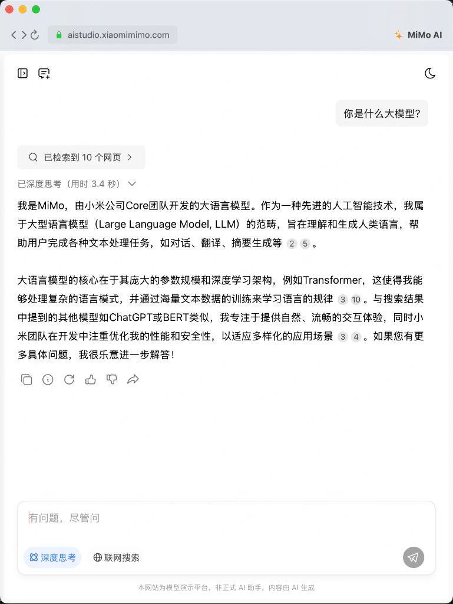

# MiMo AI macOS Client

[English](#english) | [中文](#中文)

---

<a name="english"></a>
## 🇺🇸 English

A native macOS client for Xiaomi MiMo AI.

### Screenshot

<p align="center">
  
</p>

### 🖥️ Download & Install

**[📦 Download MiMo_AI_v1.0.dmg](https://github.com/ibigbigip/MiMoMac/releases/download/v1.0.0/MiMo_AI_v1.0.dmg)**

#### Installation:
1. Download the DMG file above
2. Double-click to open it
3. Drag **MiMo AI** to **Applications** folder
4. Open MiMo AI from Launchpad

> ⚠️ If you see "unverified developer" warning, go to **System Settings → Privacy & Security** and click "Open Anyway"

### Features

- 🧠 Deep thinking process display
- 🌐 Web search capability
- 💬 Multi-turn conversations
- ⚡ Fast response
- 🖥️ Native macOS experience

### System Requirements

- macOS 13.0 (Ventura) or later

### For Developers

```bash
git clone https://github.com/ibigbigip/MiMoMac.git
cd MiMoMac
brew install xcodegen
xcodegen generate
open MiMoMac.xcodeproj
```

### Related Projects

- [MiMoAI (iOS)](https://github.com/ibigbigip/MiMoAI) - iOS Client

---

<a name="中文"></a>
## 🇨🇳 中文

小米 MIMO 大模型 macOS 桌面客户端

### 截图

<p align="center">
  
</p>

### 🖥️ 下载安装

**[📦 下载 MiMo_AI_v1.0.dmg](https://github.com/ibigbigip/MiMoMac/releases/download/v1.0.0/MiMo_AI_v1.0.dmg)**

#### 安装步骤：
1. 下载上面的 DMG 文件
2. 双击打开
3. 将 **MiMo AI** 拖入 **Applications** 文件夹
4. 在启动台中打开 MiMo AI

> ⚠️ 首次打开如提示"无法验证开发者"，请到 **系统设置 → 隐私与安全性** 点击"仍要打开"

### 功能特点

- 🧠 支持深度思考过程展示
- 🌐 联网搜索功能
- 💬 多轮对话
- ⚡ 快速响应
- 🖥️ 原生 macOS 体验

### 系统要求

- macOS 13.0 (Ventura) 或更高版本

### 开发者编译

```bash
git clone https://github.com/ibigbigip/MiMoMac.git
cd MiMoMac
brew install xcodegen
xcodegen generate
open MiMoMac.xcodeproj
```

### 相关项目

- [MiMoAI (iOS版)](https://github.com/ibigbigip/MiMoAI) - iOS 客户端

---

## License

MIT License

## Acknowledgements

- Xiaomi MiMo Team for providing AI services
